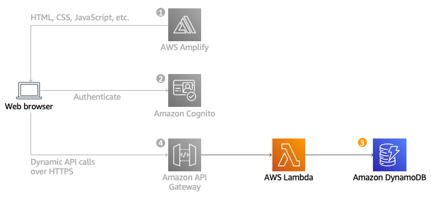

<h1>Overview</h1>

AWS Lambda and Amazon DynamoDB to build a backend process for handling requests for your web application. The browser application that you deployed in the first module allows users to request that a unicorn be sent to a location of their choice. To fulfill those requests, the JavaScript running in the browser will need to invoke a service running in the cloud.

<h1>Architecture overview</h1>

The idea is to implement a Lambda function that will be invoked each time a user requests a unicorn. The function will select a unicorn from the fleet, record the request in a DynamoDB table, and then respond to the frontend application with details about the unicorn being dispatched.

The function is invoked from the browser using Amazon API Gateway.

<h1>Implementation</h1>

<h2>Create an Amazon DynamoDB table</h2>
<h2>Create an IAM role for Lambda function</h2>
<h2>Create a Lambda function for handling requests</h2>
