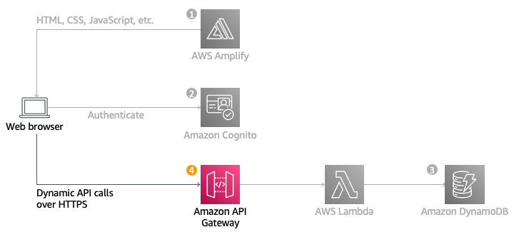

<h1>Overview</h1>

Amazon API Gateway is used to expose the Lambda function built in as a RESTful API. This API will be accessible on the public Internet. It will be secured using the Amazon Cognito user pool you created in the AWS Conginito. Using this configuration, then turn my statically hosted website into a dynamic web application by adding client-side JavaScript that makes AJAX calls to the exposed APIs.

<h1>Architecture overview</h1>

The diagram above shows how the API Gateway component you will build in this module integrates with the existing components I built previously. The grayed out items are pieces I have already implemented in previous steps.

The static website I deployed in the beginning already has a page configured to interact with the API you will build in this module. The page at /ride.html has a simple map-based interface for requesting a unicorn ride. After authenticating using the /signin.html page, users will be able to select their pickup location by clicking a point on the map and then requesting a ride by choosing the "Request Unicorn" button in the upper right corner.

<h1>Implementation</h1>

<h2>Create a new REST API</h2>

<h2>Create authorizer</h2>

create an Amazon Cognito User Pools Authorizer. Amazon API Gateway uses JSON web tokens (JWT), which are returned by the Amazon Cognito User Pool to authenticate the API calls. In this section, we will be creating an Authorizer for the API, so we can make use of the user pool.

<h2>Create a new resource and method</h2>

Create a new resource within your API. Then create a POST method for that resource and configure it to use a Lambda proxy integration backed by the RequestUnicorn function you created in the first step

<h2>Deploy API</h2>

<h2>Update the website config</h2>

In this step, update the /js/config.js file in the website deployment to include the Invoke URL of the stage you just created. I copy the Invoke URL directly from the top of the stage editor page on the Amazon API Gateway console and paste it into the invokeUrl key of your site's config.js file. My config file will still contain the updates I made in the previous Amazon Cognito userPoolID, userPoolClientID, and region.
