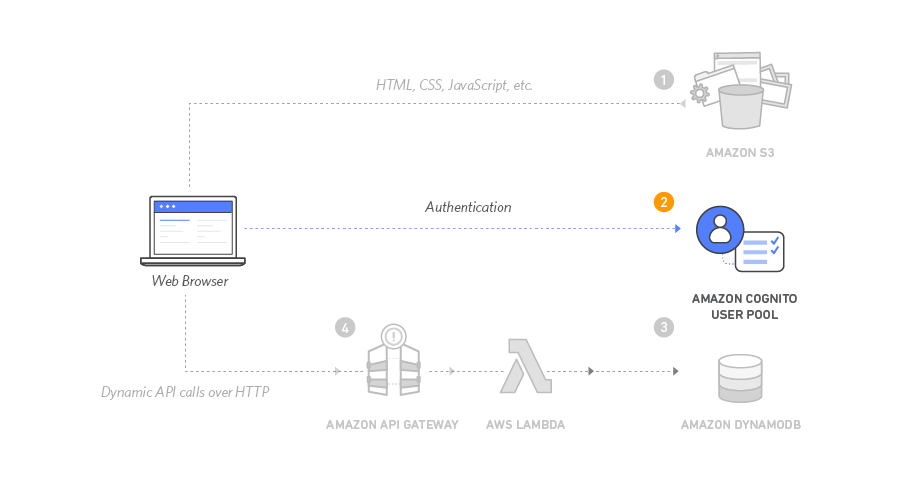

<h1>Overview</h1>

Create an Amazon Cognito user pool to manage your users' accounts. I deployed pages that enable customers to register as a new user, verify their email address, and sign into the site.

<h1>Architecture overview</h1>

When users visit the website they will first register a new user account. For the purposes of this workshop we'll only require them to provide an email address and password to register. However, you can configure Amazon Cognito to require additional attributes in your own applications, such as phone number, home address, or any preferences.

After users submit their registration, Amazon Cognito will send a confirmation email with a verification code to the address they provided. To confirm their account, users will return to the site and enter their email address and the verification code they received. There is one way to confirm user accounts using the Amazon Cognito console with a fake email addresses for testing.

After users have a confirmed account (either using the email verification process or a manual confirmation through the console), they will be able to sign in. When users sign in, they enter their username (or email) and password. A JavaScript function then communicates with Amazon Cognito, authenticates using the Secure Remote Password protocol (SRP), and receives back a set of JSON Web Tokens (JWT). The JWTs contain claims about the identity of the user and will be used in the next module to authenticate against the RESTful API you build with Amazon API Gateway.

<h1>Implementation</h1>
<h2>Create an AWS Cognito user pool and integrate an app with user pool</h2>

Amazon Cognito provides two different mechanisms for authenticating users. One option is using Cognito User Pools to add sign-up and sign-in functionality to your application or use Cognito Identity Pools to authenticate users through social identity providers such as Facebook, Twitter, or Amazon, with SAML identity solutions, or by using your own identity system. For this module you'll use a user pool as the backend for the provided registration and sign-in pages.

<h2>Update the website config file</h2>

The js/config.js file contains settings for the user pool ID, app client ID and Region. Update this file with the settings from the user pool and app you created in the previous steps and upload the file back to the bucket.

<h2>Validating the implementation</h2>

